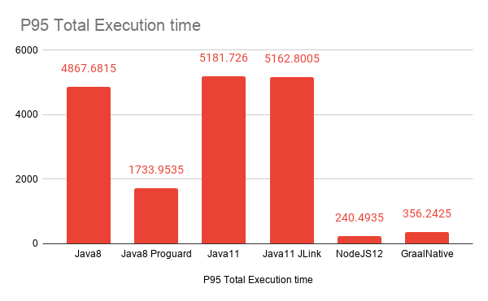

## Scala AWS Lambda Runtimes

This repo contains a setup to compare the *cold* startup times of the lambdas written is scala.
 


| Runtime |  Min (ms) | P95 (ms) | Max (ms) | Memory used (MB)  | Package size (MB) |
|  ------ | --------- | -------- | -------- | ----------------- | ----------------- |
|  Java8  |    4128   |   4867   |   4953   |        72         |       5.7         |
|  Java8 Proguard  |    1373   |   1733   |   1957   |        62         |       0.446         |
|  Java11  |    4298   |   5181   |   5274   |        96         |       5.7         |
|  Java11 JLink |    3061   |   5162   |   6051   |        128         |       23         |
|  NodeJS 12  |    125   |   **240**   |   378   |        65         |       0.0022         |
|  Graal Native  |    230   |   356   |   413   |        **58**         |       9.3         |

The raw execution results can be found in the `/executions` folder.
The data is collected with the CloudWatch Logs Insights using this query:
```
    filter @type = "REPORT"
    
    | fields @timestamp as Timestamp, @initDuration as InitDurationInMS, @duration as DurationInMS, @billedDuration as BilledDurationInMS, @memorySize/1000000 as MemorySetInMB, @maxMemoryUsed/1000000 as MemoryUsedInMB
    | sort Timestamp desc
    | head 200
```


#### Building and packaging Lambdas
```
make build_all
```

#### Deploying all the Lambdas
```
make serverless command="serverless deploy"
```

#### Measuring the cold starts
```
make serverless command="lumigo-cli measure-lambda-cold-starts --functionName=scala-lambda-runtimes-dev-jvmLambda8 --invocations=100 --region=us-east-1"
```

#### Destroying AWS resources
```
make serverless command="serverless remove"
```
